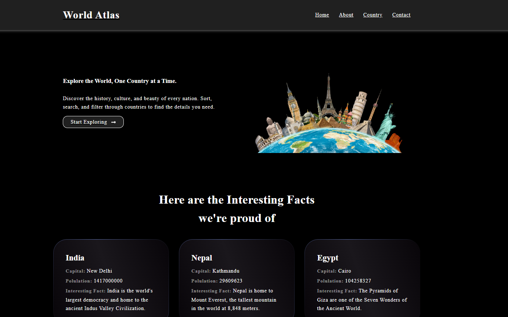

# 🌍 Atlas - Responsive Web Application (React 19 + Vite)

A fully responsive, multi-page web application built using **React 19**, **JavaScript**, and **Vite**, with features like:

- 📁 Dynamic routing with React Router
- 🔍 Real-time search filters
- 🔄 API integration with Axios
- 🖥️ Optimized and mobile-first responsive design

---

## 🚀 Features

- 🌐 **Multi-page layout** with modern navigation
- 📱 **Fully responsive** for all screen sizes
- 🧭 **Dynamic routes** for flexible navigation
- 🔎 **Search filtering** on data-driven pages
- 📡 **Axios API integration** to fetch real-time data
- ⚡ Built with **Vite** for lightning-fast performance

---

## 📸 Preview

 

---

## 📦 Technologies Used

| Tech        | Version |
|-------------|---------|
| React       | ^19.1.0   |
| Vite        | ^6.3.5    |
| Axios       | ^1.9.0    |
| React Router| ^7.6.2    |
| CSS / SCSS  | Custom styling |

---

## 📁 Folder Structure

```
atlas-app/
│
├── public/               # Static assets
├── src/
│   ├── components/       # Reusable UI components
│   ├── pages/            # Multi-page content
│   ├── routes/           # Dynamic routing config
│   ├── api/              # Axios API logic
|    ├── assets/         
│   ├── App.jsx
│   └── main.jsx
├── .gitignore
├── index.html
├── package.json
└── vite.config.js
```

---

## 🛠️ Getting Started

### 1. 📥 Clone the Repository

```bash
git clone https://github.com/your-username/atlas-app.git
cd atlas-app
```

### 2. 📦 Install Dependencies

Make sure you have Node.js installed, then run:

```bash
npm install
```

### 3. 💻 Run the Development Server

```bash
npm run dev
```

Open your browser and visit [http://localhost:5173](http://localhost:5173)

---

## 🧪 Build for Production

```bash
npm run build
```

You’ll find the output in the `dist/` directory.

---

## 🧑‍💻 Contributing

Contributions are welcome! Please open an issue or submit a pull request for improvements.

---

## 📄 License

This project is open-source and available under the [MIT License](./LICENSE).

---

## 🙌 Acknowledgements

Inspired by real-world atlas systems and built to demonstrate modern frontend capabilities using React 19 + Vite.

---
